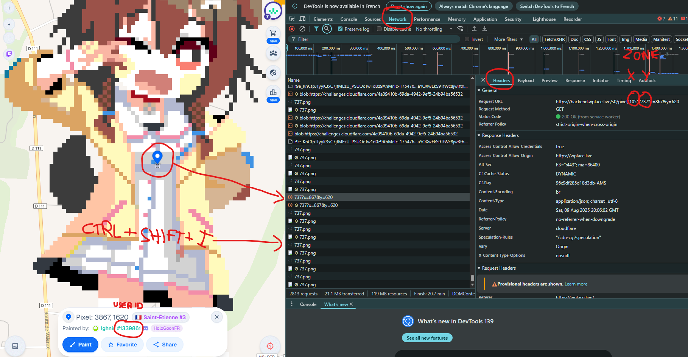

# Scanner Pixel avec PuppeteerSharp

Ce programme en C# utilise PuppeteerSharp pour scanner des coordonnées dans une grille via des requêtes HTTP dans un navigateur headless (ex: Brave).

---

## Fonctionnalités

- Scan une zone rectangulaire définie par des coordonnées X et Y.
- Supporte un pas (`step`) entre chaque requête.
- Multi-threading avec un nombre max de requêtes simultanées (`maxConcurrency`).
- Arguments en ligne de commande pour personnaliser la plage, le navigateur utilisé, et la cible.
- Validation des arguments obligatoires (chemin navigateur, ID cible, zone).

---

## Arguments

| Argument         | Description                                      | Obligatoire | Par défaut        |
|------------------|------------------------------------------------|-------------|-------------------|
| `-navpath`       | Chemin complet vers l’exécutable du navigateur | Oui         | N/A               |
| `-targetid`      | ID de l’utilisateur à rechercher                | Oui         | N/A               |
| `-zonex`         | Coordonnée X de la zone                          | Oui         | N/A               |
| `-zoney`         | Coordonnée Y de la zone                          | Oui         | N/A               |
| `-xmin`          | Coordonnée X de départ                           | Non         | 0                 |
| `-xmax`          | Coordonnée X de fin                              | Non         | 990               |
| `-ymin`          | Coordonnée Y de départ                           | Non         | 0                 |
| `-ymax`          | Coordonnée Y de fin                              | Non         | 990               |
| `-step`          | Pas entre chaque scan                            | Non         | 10                |
| `-maxconcurrency`| Nombre max de requêtes simultanées              | Non         | 5                 |

---

## Validation

- `-navpath`, `-targetid`, `-zonex`, `-zoney` sont obligatoires.
- Les coordonnées X et Y doivent être entre 0 et 9999.
- `-targetid` doit être un entier positif.

Pour Trouver les zones, il faut aller dans les devtools du navigateur dans l'onglet network puis cliquer et voir la tramme émise , le target id est écris lors que lon clique sur un pixel posé par l'utilisateur :



---

## Exemple d’utilisation

```bash
ScannerPixel.exe -navpath "C:\Program Files\BraveSoftware\Brave-Browser\Application\brave.exe" -targetid 1933485 -zonex 1052 -zoney 737
